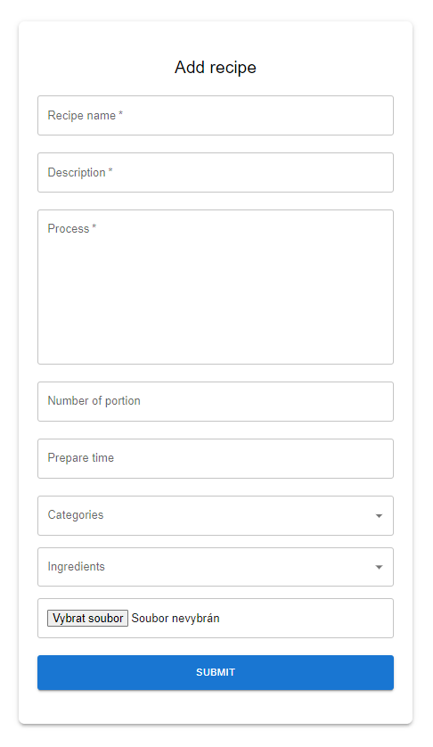

# Receptář - Frontend

Aplikace slouží pro účely semestrální práce pro předmět NNPIA. Semestrální práce se skládá ze dvou částí.
Tato část slouží jako frontend pro aplikaci, která má sloužit jako jakýsi receptář. Aplikace by měla umožnit
uživatelům vyhledávat recepty. Registrovaní a přihlášení uživatelé mají možnost přidávat nové recepty a
a také si je přidávat mezi své oblíbené recepty.

## Instalace

Dle zadání semestrální práce nebylo nutné nahrávat aplikaci na žádný server a proto aplikace běží jen lokálně. Ke spuštění je potřeba spustit docker container s databází, backend a frontend.

## Příklady

Několik příkladů, jak aplikace funguje.

Formulář k přihlášení, který vyžaduje uživatelské jméno a heslo. Po správném zadání přesměruje na domovskou stránku.

Registrační formulář.

Domovská stránka, která obashuje horní panel pro vyhledávání, domovské tlačítko nalevo a na pravé straně obashuje rozklikávací menu, které nabízí dle oprávnění volby.
Admin má možnost spravovat kategorie a ingredience. Běžný uživatel má poté přístip k profilu. Tam najde své přidané recepty a recepty, které si přidal mezi oblíbené, také pod touto položkou může přidívat nové recepty. Hlavní stránka tedy obsahuje možnost vyhledávání dle názvu, řazení dle jména nebo hodnocení vzestupně, či sestupně. Lze také tyto dvě možnosti kombinovat.

Detail receptu obsahuje vlastnosti, se kterými byl recept vytvořen.

Formulář pro přidání nového receptu.

Správa kategorií. Nabízí přidání nové kategorie, smazání existující a editaci již existující.

Správa ingrediencí. Nabízí přidání nové ingredience, smazání existující a editaci již existující.

Stránka profilu, která umožňuje zobrazit přidané recepty, oblíbené, tak tlačítko na přidání nového, které přesměruje uživatele na formulář pro přidání receptu.

